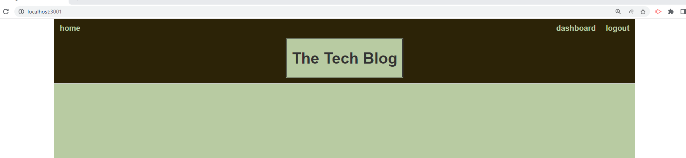
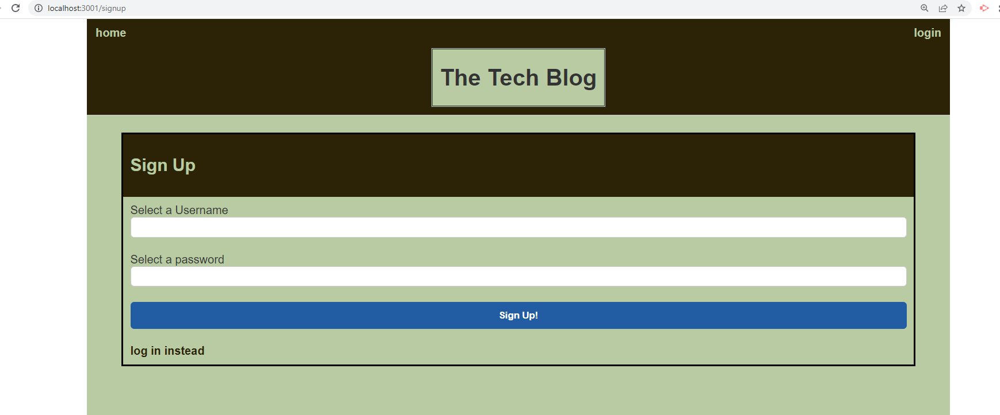

# <Title>
Blog with handlebars

## Desciption

The challenge for this assignment is to have a tech blog. The features that this blog needs are a home page, login in page and sign up page. Once you are in then you need to have a creat new post with a title and content. After the post has been made it will go to your dashdoard with the time it has been posted with an edit option. If you click edit you can update or delete the post

## Installation
You need the do npm install (all the stuff in features). Then you can type in the terminal (node server.js) or (npm start).

## usage
the usage is to blog stuff about tech.

## Features
bcrypt
connect-session-sequelize
dotenv
express
express-handlebars
express-session
mysql2
sequelize

## screen shoot

